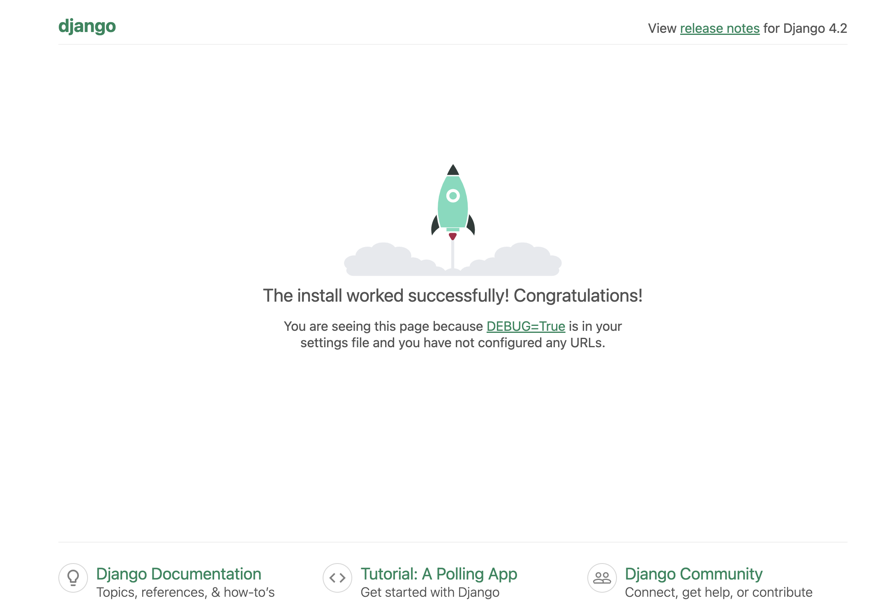

# Prerequisite

* Docker
* make

# Linux OS

```bash
Distributor ID:	Ubuntu
Description:	Ubuntu 22.04.3 LTS
Release:	22.04
Codename:	jammy
```

# How to use it ?

```bash
$ make

Usage:
  make <target>

Docker
  show             Show current running container
  build            Build container images
  run              Start container
  restart          Restart container
  stop             Stop container
  down             Remove all container clean            Garbage disposal
```

## Step1: Edit the `docker-compose.yaml` file

In the `docker-compose.yaml` file, please replace below key words.
  - images: `<DOCKER HUB ACCOUNT>`/mssql
  - MSSQL_SA_PASSWORD: `'<MSSQL_SA_PASSWORD>'`

## Step2: Use the `make build` to generate the container images.

```bash
make build
```

## Step3: Use the `make run` to start container.

```bash
make run
```

## Step3: Setup SQL Server and Django

### Login to container - web

```bash
docker exec -it <CONTAINER_NAME> bash
```

### Setup SQL Server

  - Show current all databases

    ```bash
    $ sqlcmd -S <CONTAINER_NAME>,1433 -U SA -P '<MSSQL_SA_PASSWORD>' -C -Q "SELECT Name from sys.databases;"
    
    Name
    --------------------------------------------------------------------------------------------------------------------------------
    master
    tempdb
    model
    msdb

    (4 rows affected)
    ```

  - Create the database in the SQL Server

    ```bash
    $ sqlcmd -S <CONTAINER_NAME>,1433 -U SA -P '<MSSQL_SA_PASSWORD>' -C -Q "USE master; CREATE DATABASE <DATABASE_NAME>;"
    ```

  - Create a database account

    ```bash
    $ sqlcmd -S <CONTAINER_NAME>,1433 -U SA -P '<MSSQL_SA_PASSWORD>' -C -Q "USE <DATABASE_NAME>; CREATE LOGIN <DB_ACCOUNT> WITH PASSWORD = '<DB_PASSWORD>';"
    $ sqlcmd -S <CONTAINER_NAME>,1433 -U SA -P '<MSSQL_SA_PASSWORD>' -C -Q "USE <DATABASE_NAME>; CREATE USER <DB_ACCOUNT> FOR LOGIN <DB_ACCOUNT>;"
    ```

  - Grant <DB_ACCOUNT> into the `db_owner` group

    ```bash
    $ sqlcmd -S <CONTAINER_NAME>,1433 -U SA -P '<MSSQL_SA_PASSWORD>' -C -Q "USE <DATABASE_NAME>; ALTER ROLE db_owner ADD MEMBER <DB_ACCOUNT>;"
    ```

  - Test connection

    ```bash
    $ sqlcmd -S <CONTAINER_NAME>,1433 -U <DB_ACCOUNT> -P '<DB_PASSWORD>' -C -Q "SELECT Name from sys.databases;"
    ```

### Setup Web Server

  - Edit `settings.py` to be replaced below content.

    ```bash
    ALLOWED_HOSTS = ["*"]
    
    #DATABASES = {
    #    'default': {
    #        'ENGINE': 'django.db.backends.sqlite3',
    #        'NAME': BASE_DIR / 'db.sqlite3',
    #    }
    #}
    DATABASES = {
        'default': {
            'ENGINE': 'mssql',
            'NAME': '<DATABASE_NAME>',
            'HOST': '<CONTAINER_NAME>',
            'PORT': '1433',
            'USER': '<DB_ACCOUNT>',
            'PASSWORD': '<DB_PASSWORD>',
            'OPTIONS': {
              'driver': 'ODBC Driver 18 for SQL Server',
              'setencoding': [{'encoding': 'utf-8'}],
              'extra_params': 'Encrypt=no;TrustServerCertificate=yes'
            }
        }
    }
    ```

  - Run DB migration

    ```bash
    $ python3 manage.py migrate
    Operations to perform:
      Apply all migrations: admin, auth, contenttypes, sessions
    Running migrations:
      Applying contenttypes.0001_initial... OK
      Applying auth.0001_initial... OK
      Applying admin.0001_initial... OK
      Applying admin.0002_logentry_remove_auto_add... OK
      Applying admin.0003_logentry_add_action_flag_choices... OK
      Applying contenttypes.0002_remove_content_type_name... OK
      Applying auth.0002_alter_permission_name_max_length... OK
      Applying auth.0003_alter_user_email_max_length... OK
      Applying auth.0004_alter_user_username_opts... OK
      Applying auth.0005_alter_user_last_login_null... OK
      Applying auth.0006_require_contenttypes_0002... OK
      Applying auth.0007_alter_validators_add_error_messages... OK
      Applying auth.0008_alter_user_username_max_length... OK
      Applying auth.0009_alter_user_last_name_max_length... OK
      Applying auth.0010_alter_group_name_max_length... OK
      Applying auth.0011_update_proxy_permissions... OK
      Applying auth.0012_alter_user_first_name_max_length... OK
      Applying sessions.0001_initial... OK
    ```

### Restart Web Server

  - Restart Web Container

  ```bash
  make restart
  ```

  - Open your browser, you can see like below

    
